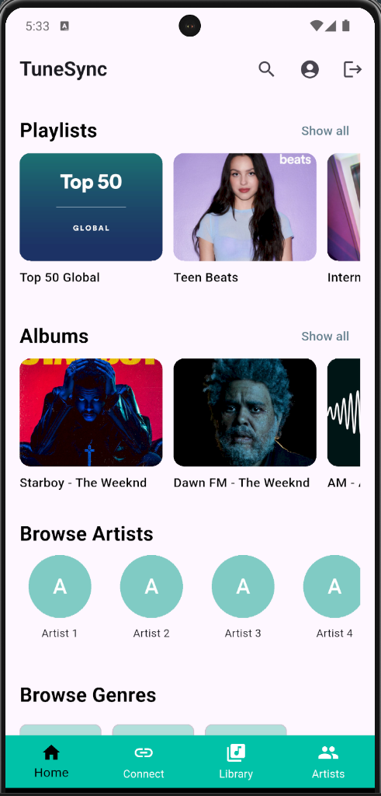
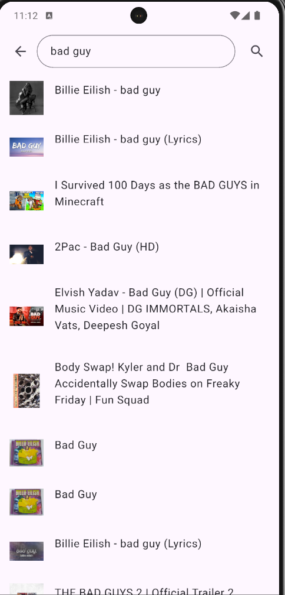
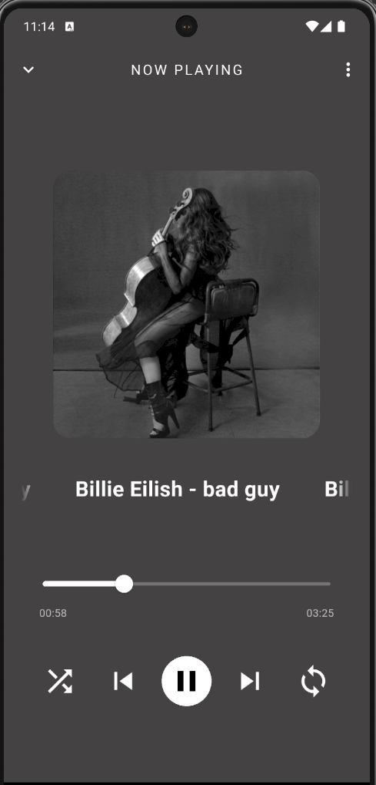
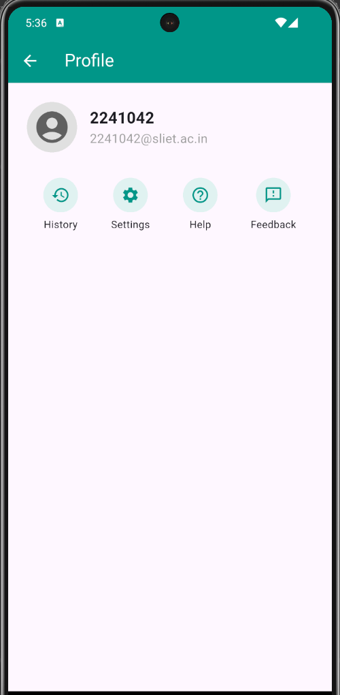
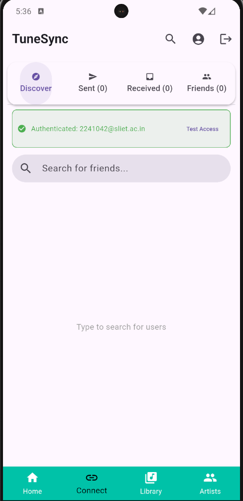

# TuneSync 🎵

**TuneSync** is a modern Flutter app that allows two users to connect and listen to the same music simultaneously in real-time. Whether you're syncing tunes with friends or just vibing together remotely, TuneSync brings shared music experiences to life.

---

## 🚀 Features

- 🔄 **Real-time Tune Synchronization** – Seamlessly sync music playback across devices.
- 📡 **Live Music Streaming** – Stream audio in real-time with minimal latency.
- 🎧 **YouTube Audio Extraction** – Uses [youtube_explode_dart](https://pub.dev/packages/youtube_explode_dart) to extract audio from YouTube.
- 🎶 **Just Audio Integration** – Smooth and efficient audio playback using the [just_audio](https://pub.dev/packages/just_audio) package.
- 🔐 **Firebase Authentication** – Sign in and sign up using secure and scalable Firebase Auth.
- 👥 **Presence Tracking** – Tracks user presence using Firebase Firestore.
- ⚙️ **State Management** – Clean and scalable app architecture using the [provider](https://pub.dev/packages/provider) package.

---

## 📸 Screenshots

### 🏠 Home Screen

---

### 🔍 Search Song

---

### 🎵 Now Playing

---

### 👤 Profile Page

---

### 🔗 Connect Page

---

## 🛠️ Getting Started

This project is a starting point for a Flutter application.

A few resources to get you started if this is your first Flutter project:

- [Lab: Write your first Flutter app](https://docs.flutter.dev/get-started/codelab)
- [Cookbook: Useful Flutter samples](https://docs.flutter.dev/cookbook)

For help getting started with Flutter development, view the
[online documentation](https://docs.flutter.dev/), which offers tutorials,
samples, guidance on mobile development, and a full API reference.

---

## 📂 Tech Stack

- **Flutter**
- **Dart**
- **Firebase (Auth + Firestore)**
- **youtube_explode_dart**
- **just_audio**
- **provider**

---

## 👨‍💻 Author

**Kishan Kumar Singh** – [GitHub](https://github.com/12kishansingh)

---

## 📃 License

This project is licensed under the MIT License — see the [LICENSE](LICENSE) file for details.
